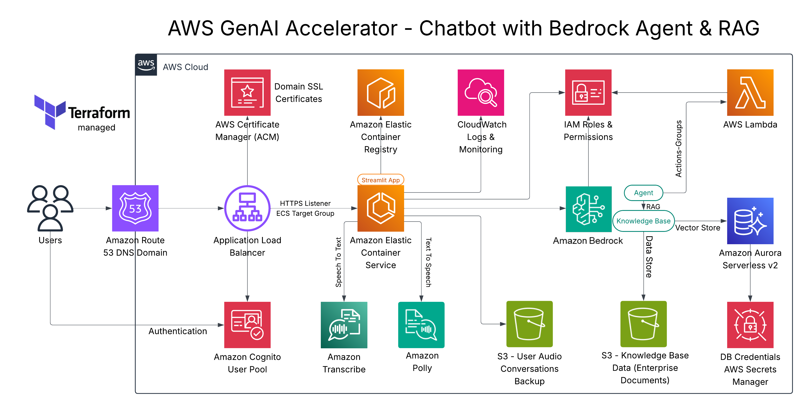
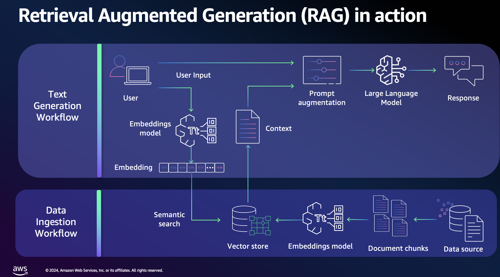
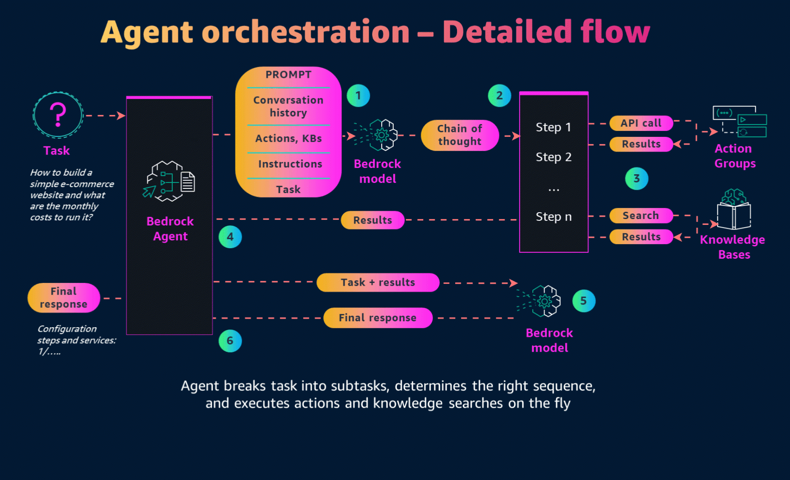
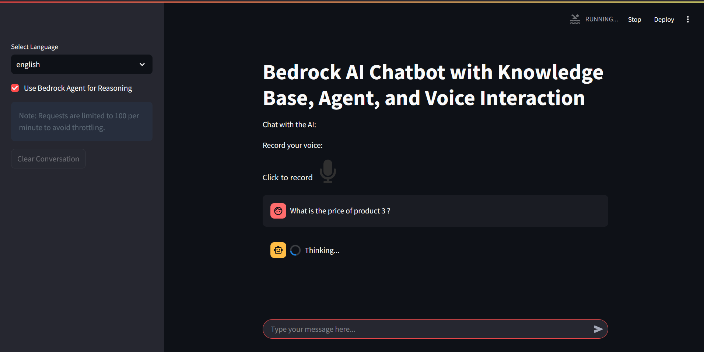
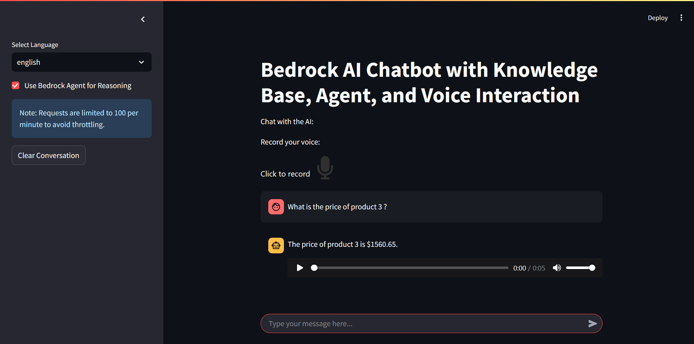
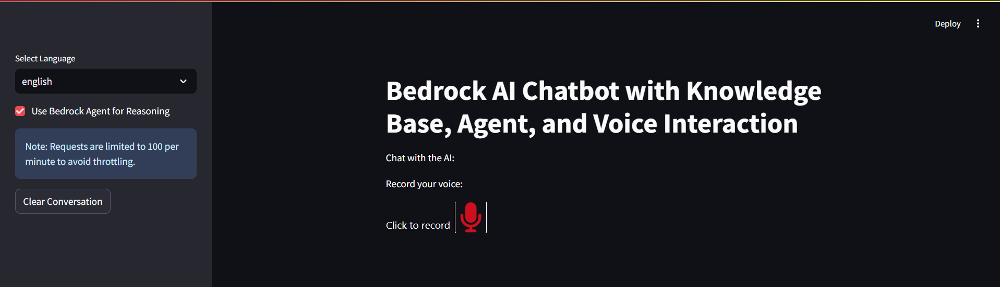
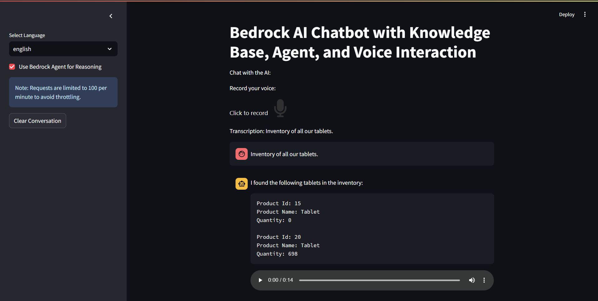
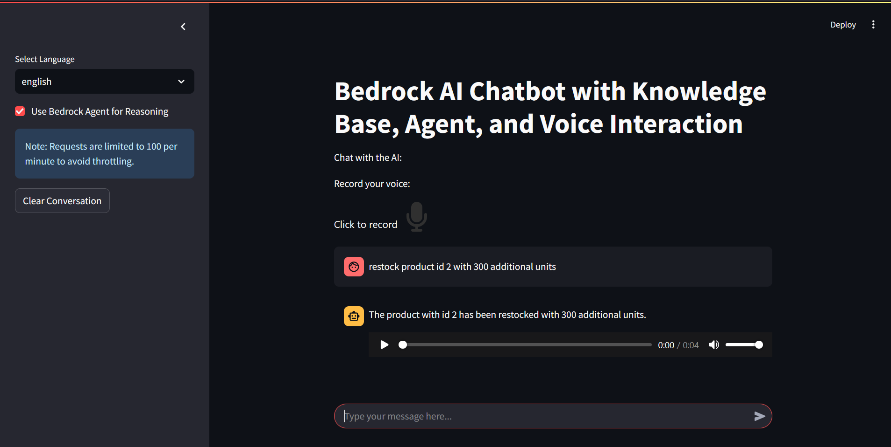

# AWS Bedrock RAG Chatbot Infrastructure

This AWS Accelerator/Proof of Concept (PoC) demonstrates the implementation of a **Bedrock-powered chatbot agent** integrated with a **Knowledge Base** using **Retrieval-Augmented Generation (RAG)**. The solution leverages **Amazon Bedrock** for natural language understanding and contextual responses while enhancing accuracy through the RAG approach.  

To provide an interactive interface, the PoC utilizes **Streamlit**, enabling a lightweight application web UI hosted in **Amazon ECS (Elastic Container Service)**, UI for seamless interaction with the Bedrock Agent and its Knowledge Base. After authentication, this UI allows users to input queries, retrieve relevant information, and receive AI-driven responses in real time.  

The infrastructure is managed by **Terraform (IaC)** and the repository contains code to deploy an end-to-end environment to host the RAG chatbot.

# Table of Contents

- [Architecture Overview](#-architecture-overview)
- [AWS RAG/Knowledge-Base/ Agent Orchestration](#aws-ragknowledge-base-agent-orchestration)
  - [Knowledge Base data](#knowledge-base-data)
  - [Bedrock Agent orchestration](#bedrock-agent-orchestration)
- [Terraform Deploymnt](#terraform-deployment)
  - [Prerequisites](#-prerequisites)
  - [Key Variables](#️-key-variables)
  - [Deployment](#️-deployment)
  - [DNS & Endpoints](#-dns--endpoints)
  - [Authentication Flow](#-authentication-flow)
  - [Knowledge Base Setup](#-knowledge-base-setup)
  - [Bedrock Agent Action Groups](#-bedrock-agent-action-groups)
- [Application & Dockerization](#application--dockerization)
  - [The application components](#the-application-components)
    - [Features](#features)
    - [Application Overview](#application-overview)
  - [Dockerization & tests](#dockerization--tests)
  - [Pushing Docker image to AWS ECR](#pushing-docker-image-to-aws-ecr)
- [Demos: Screenshots](#demos-screenshots)
  - [Agent RAG - Knowledge-Base](#agent-rag---knowledge-base)
  - [Voice chatting - Agent Action Groups: Action 1: /GetProductsInventory](#voice-chatting---agent-action-groups-action-1-getproductsinventory)
  - [Agent Action Groups: Action 2: /RestockProduct](#agent-action-groups-action-2-restockproduct)
- [License](#license)

# 🚀 Architecture Overview



* This repository contains Terraform code to deploy the RAG-Chatbot using AWS Bedrock, Amazon ECS (EC2 launch type, could be adjusted to Fargate), Application Load Balancer with Cognito authentication, and Aurora PostgreSQL Serverless v2 for vector storage.

* The chatbot is accessible through a secure HTTPS endpoint protected by Cognito, integrates with Bedrock Agents, and supports retrieval from a Knowledge Base (RDS + S3).
The infrastructure provisions the following:

* **Networking & Security**

  * Uses the default VPC with public and private subnets
  * Security groups for ALB, ECS instances, and Aurora DB
  * HTTPS-only ingress with ACM-managed TLS certificates

* **Authentication**

  * Amazon Cognito User Pool + App Client
  * Custom Cognito domain `authentication.chatbot.<root_domain>`
  * Route53 records for authentication and main chatbot domain

* **Application Hosting**

  * ECS Cluster with EC2 instances (Amazon Linux 2 ECS-optimized AMI)
  * Autoscaling Group with configurable `min`, `max`, and `desired` instance counts
  * ECS Task Definition running the chatbot container (Streamlit app on port 8501)
  * Application Load Balancer (ALB) with Cognito authentication and target group

* **Storage & Data**

  * S3 bucket for **voice MP3 uploads** (used by AWS Transcribe)
  * S3 bucket for **knowledge base documents** 
  * Aurora PostgreSQL Serverless v2 cluster for embeddings storage
  * Secrets Manager for Aurora DB credentials
  * Usage of **Amazon Polly** (TTS) when the user submits a voice request

* **AI & Bedrock**

  * Bedrock Knowledge Base with vector embeddings (Titan embedding model)
  * Bedrock Agent with RAG capabilities
  * Agent associated with Knowledge Base
  * Bedrock Action Group backed by AWS Lambda (with OpenAPI schema for product inventory example APIs)

* **Observability**

  * CloudWatch Logs integration for ECS tasks and Lambda
  * Custom CloudWatch dashboard (GenAI Infrastructure Overview) showing some infrastructure metrics related to Bedrock, ECS, ALB, Cognito & RDS Aurora DB.

* **Access and Permissions**

  * Multiple IAM roles & permissions for a fine-grained access and communications between the used services

# AWS RAG/Knowledge-Base/ Agent Orchestration



AWS Retrieval-Augmented Generation (RAG) enhances large language model (LLM) responses by integrating external knowledge retrieval. The process consists of two main workflows: Data Ingestion and Text Generation. In the Data Ingestion Workflow, raw data from various sources is chunked, processed through an embeddings model, and stored in a vector database for efficient retrieval. During the Text Generation Workflow, when a user inputs a query, the system generates an embedding, performs semantic search to fetch relevant context, and augments the prompt before passing it to the LLM. This approach ensures responses are more accurate, contextual, and grounded in the latest knowledge base, making AWS RAG ideal for enterprise chatbot agents, knowledge management, and intelligent search applications.

## Knowledge Base data

For this PoC/Accelerator we used files of a fictive Ecommerce company
The Ecommerce company has a list of 30 products. Each product has Product Id, Product Name, Type, Color, Weight, Size, Company, Price

```

Product Id ,Product Name ,Type        ,Color  ,Weight ,Size   ,Company       ,Price
1          ,Laptop       ,Accessories ,Purple ,  0.71 ,Medium ,Innovatech    , 637.46
2	   ,Keyboard     ,Peripheral  ,Silver ,  4.85 ,Large  ,TechCorp      ,1040.42
3	   ,Smartphone   ,Accessories ,Blue   ,  4.46 ,Large  ,Innovatech    ,1560.65
4	   ,Mouse        ,Gadget      ,Blue   ,  2.73 ,Small  ,GizmoWorks    , 431.01
5	   ,Headphones   ,Peripheral  ,Yellow ,  3.24 ,Small  ,TechCorp      , 445.21
6	   ,Headphones   ,Electronics ,Black  ,  1.88 ,Small  ,Innovatech    , 918.11
7	   ,Camera       ,Peripheral  ,Silver ,  0.62 ,Medium ,GizmoWorks    ,  71.01
8 	   ,Smartwatch   ,Peripheral  ,Silver ,  2.3  ,Small  ,FutureGadgets , 365.63
9 	   ,Smartphone   ,Gadget      ,Red    ,  2.18 ,Medium ,TechCorp      ,1259.68
10 	   ,Monitor      ,Peripheral  ,Blue   ,  4.76 ,Small  ,ElectroWorld  , 678.29
11 	   ,Headphones   ,Electronics ,Red    ,  3.87 ,Medium ,ElectroWorld  ,  91.08
12 	   ,Camera       ,Gadget      ,Purple ,  0.55 ,Medium ,GizmoWorks    , 141.94
13 	   ,Keyboard     ,Gadget      ,Green  ,  1.14 ,Small  ,ElectroWorld  ,1214.66
14 	   ,Keyboard     ,Electronics ,Red    ,  4.5  ,Medium ,TechCorp      ,1986.38
15 	   ,Tablet       ,Accessories ,Red    ,  3.91 ,Large  ,TechCorp      ,1424.65
16 	   ,Mouse        ,Gadget      ,White  ,  4.48 ,Small  ,TechCorp      , 101.15
17 	   ,Smartwatch   ,Peripheral  ,Green  ,  1.17 ,Large  ,Innovatech    ,1604.75
18 	   ,Keyboard     ,Electronics ,Green  ,  2.75 ,Medium ,TechCorp      ,1883.91
19 	   ,Smartphone   ,Peripheral  ,White  ,  1.06 ,Medium ,FutureGadgets ,1753.38
20 	   ,Tablet       ,Electronics ,Green  ,  1.26 ,Small  ,GizmoWorks    , 175.14
21 	   ,Smartphone   ,Accessories ,White  ,  2.23 ,Small  ,ElectroWorld  ,1087.54
22 	   ,Camera       ,Accessories ,Silver ,  4.94 ,Medium ,GizmoWorks    , 565.4
23 	   ,Smartphone   ,Electronics ,Yellow ,  1.68 ,Small  ,FutureGadgets ,1583.0
24 	   ,Tablet       ,Peripheral  ,Silver ,  2.51 ,Small  ,Innovatech    , 736.29
25 	   ,Smartphone   ,Electronics ,Blue   ,  4.82 ,Large  ,Innovatech    ,1767.96
26 	   ,Tablet       ,Gadget      ,Purple ,  3.18 ,Medium ,ElectroWorld  , 193.94
27 	   ,Monitor      ,Peripheral  ,Blue   ,  0.94 ,Large  ,GizmoWorks    ,1989.49
28 	   ,Laptop       ,Gadget      ,Pink   ,  0.72 ,Medium ,TechCorp      ,1924.99
29 	   ,Smartphone   ,Peripheral  ,Purple ,  4.2  ,Small  ,ElectroWorld  ,  59.31
30 	   ,Keyboard     ,Electronics ,Purple ,  4.62 ,Medium ,TechCorp      , 631.51
```
Use script: `generate_kb_data.py` to generate fictive data that will be used by the AWS Knowledge-Base.
The file `products_inventory.json` contains the inventory of some products. This inventory will be used for the Bedrock Agent Action Groups (`/GetProductsInventory`) inside the related lambda function.

```
            {"Product Id": "1", "Product Name": "Laptop", "Quantity": 297},
			{"Product Id": "2", "Product Name": "Keyboard", "Quantity": 0},
			{"Product Id": "3", "Product Name": "Smartphone", "Quantity": 463},
			{"Product Id": "4", "Product Name": "Mouse", "Quantity": 904},
			{"Product Id": "5", "Product Name": "Headphones", "Quantity": 440},
			{"Product Id": "6", "Product Name": "Headphones", "Quantity": 608},
			{"Product Id": "7", "Product Name": "Camera", "Quantity": 0},
			{"Product Id": "8", "Product Name": "Smartwatch", "Quantity": 791},
			{"Product Id": "9", "Product Name": "Smartphone", "Quantity": 384},
			{"Product Id": "10", "Product Name": "Monitor", "Quantity": 707},
			{"Product Id": "11", "Product Name": "Headphones", "Quantity": 971},
			{"Product Id": "12", "Product Name": "Camera", "Quantity": 172},
			{"Product Id": "13", "Product Name": "Keyboard", "Quantity": 936},
			{"Product Id": "14", "Product Name": "Keyboard", "Quantity": 732},
			{"Product Id": "15", "Product Name": "Tablet", "Quantity": 0},
			{"Product Id": "16", "Product Name": "Mouse", "Quantity": 642},
			{"Product Id": "17", "Product Name": "Smartwatch", "Quantity": 31},
			{"Product Id": "18", "Product Name": "Keyboard    ", "Quantity": 674},
			{"Product Id": "19", "Product Name": "Smartphone", "Quantity": 203},
			{"Product Id": "20", "Product Name": "Tablet", "Quantity": 698}
```

## Bedrock Agent orchestration



Agents orchestrate and analyze the task and break it down into the correct logical sequence using the FM’s reasoning abilities. Agents automatically call the necessary APIs to transact with the company systems and processes to fulfill the request, determining along the way if they can proceed or if they need to gather more information.

# Terraform Deployment

## 📦 Prerequisites

Before deploying, ensure you have:

1. **Terraform ≥ 1.6.0**
2. **AWS CLI configured** with credentials and access
3. A **Route53 Hosted Zone** for your domain
4. Existing **ACM certificates** for:

   * wildcard `*.your-domain.com` or `chatbot.your-domain.com`
   * `authentication.chatbot.your-domain.com`
5. An **ECR container image** for the chatbot application (see the application section for Dockerization & push to AWS ECR)
6. Do not forget to change the name of the 2 S3 buckets that will be used to store knowledge-base data and users voice inputs

---

## ⚙️ Key Variables

| Variable                               | Default                                          | Description                                            |
| -------------------------------------- | ------------------------------------------------ | ------------------------------------------------------ |
| `region`                               | `us-east-1`                                      | AWS region                                             |
| `environment`                          | `prod`                                           | Environment name                                       |
| `root_domain`                          | `crayon-poc.org`                                 | Root domain for Route53                                |
| `hosted_zone_id`                       | `Z02917741R99X3VO1YC83`                          | Route53 hosted zone ID                                 |
| `chatbot_subdomain`                    | `chatbot`                                        | Subdomain for chatbot                                  |
| `existing_acm_cert_arn`                | (ARN)                                            | ACM cert for chatbot domain                            |
| `existing_authentication_acm_cert_arn` | (ARN)                                            | ACM cert for Cognito auth domain                       |
| `container_image`                      | ECR URI                                          | Chatbot container image                                |
| `bedrock_model_id`                     | `anthropic.claude-v2`                            | Bedrock model for inference                            |
| `bedrock_foundation_model`             | `anthropic.claude-3-haiku`                       | Bedrock foundation model                               |
| `voice_bucket_name`                    | `bedrock-agent-chatbot-voice-text-conversations` | S3 bucket for voice inputs                             |
| `desired_count`                        | `1`                                              | ECS desired task count                                 |
| `instance_type`                        | `t3.small`                                       | EC2 instance type for ECS                              |
| `db_username`                          | `postgres`                                       | Aurora DB username                                     |
| `db_password`                          | `Managed by Secret Manager`                      | Aurora DB password (use Secrets Manager in production) |

## 🛠️ Deployment

### 1. Initialize Terraform

```bash
terraform init
```

### 2. Review and customize variables

Update `variables` in `main.tf` or create a `terraform.tfvars` file:

```hcl
region          = "us-east-1"
environment     = "prod"
root_domain     = "mydomain.com"
hosted_zone_id  = "Z1234567890"
container_image = "123456789012.dkr.ecr.us-east-1.amazonaws.com/my-chatbot:latest"
```
### 3. Apply the configuration

```bash
terraform apply
```
## 🌐 DNS & Endpoints

* **Chatbot Web App:**
  `https://chatbot.<root_domain>` → routed via ALB → ECS Streamlit app

* **Authentication Domain (Cognito):**
  `https://authentication.chatbot.<root_domain>`

## 🔐 Authentication Flow

1. User accesses `chatbot.<root_domain>`
2. ALB redirects to Cognito authentication
3. Cognito validates login → issues tokens
4. Authenticated traffic forwarded to ECS task

## 📚 Knowledge Base Setup

* Upload documents (to be used for the RAG) to S3 bucket: `crayon-knowledge-base-data` # it is important to change the name of this bucket for your case
* Aurora PostgreSQL cluster stores embeddings
* Vector indexes (`hnsw`) and text search indexes are automatically created
* Bedrock Knowledge Base links S3 + Aurora
* Bedrock Agent is associated with the KB

## ⚡ Bedrock Agent Action Groups

* Includes a Lambda-based action group `lambda_function.py`
* Lambda executes API requests defined by an **OpenAPI schema**
* Example: Inventory management API (`/GetProductsInventory`, `/RestockProduct`)

# Application & Dockerization

This repository contains a Python-based chatbot application that leverages AWS Bedrock services, AWS Transcribe, AWS Polly, and several other tools to provide a rich, interactive conversational experience. Users can interact with the chatbot via text or voice. The chatbot can retrieve contextual information from the knowledge-base, reason using a Bedrock agent, and even convert responses to speech for an immersive experience.

## The application components

The script: `application.py`
### Features

- **Multi-modal Interaction:** Users can communicate via text or voice.
- **Voice Transcription:** Convert recorded audio to text using AWS Transcribe.
- **Text-to-Speech (TTS):** Synthesize speech from text responses using AWS Polly.
- **Knowledge Base Integration:** Retrieve relevant context from a knowledge base.
- **Bedrock Agent:** Optionally invoke an AWS Bedrock agent for enhanced reasoning.
- **Rate Limiting:** Protects API calls from exceeding defined thresholds.
- **Streamlit Interface:** A user-friendly web UI for interactive conversations.

### Application Overview

The application is built on top of several AWS services and Python libraries:

- **AWS Bedrock Services:**  
- **Bedrock LLM:** For generating responses with a language model.
- **Bedrock Agent & Knowledge Base:** For reasoning and retrieval of contextual information.
- **AWS Transcribe:** To convert user voice input into text.
- **AWS Polly:** To generate audio (speech) from text responses.
- **S3:** For storing audio files required by AWS Transcribe.
- **Streamlit:** For building the interactive web UI.
- **Langchain:** To orchestrate prompt templates and chains for LLM interaction.
- **Rate Limit Decorators:** To prevent API throttling.

## Dockerization & tests

* Once the AWS Knowledge-Base & the Agent are set-up, the chatbot application can be tested locally in Docker.
* Below are the required files (docker-compose, Dockerfile, .env file)
* Make sure to update the .env file with your AWS Secrets having access to the required services like bedrock, polly, transcribe, s3, etc)
* command: ```docker-compose up --build```
* Connect after that to http://localhost:8501

docker-compose.yml:
```yaml
version: "3.9"

services:
  bedrock-rag-chatbot:
    build: .
    container_name: bedrock-rag-chatbot
    ports:
      - "8501:8501"
    env_file:
      - .env
    volumes:
      - .:/application
```

Dockerfile
```yaml
# Use a lightweight Python image
FROM python:3.11-slim

# Prevent Python from writing .pyc files
ENV PYTHONDONTWRITEBYTECODE=1
ENV PYTHONUNBUFFERED=1

# Create a working directory
WORKDIR /app

# Install minimal system dependencies
RUN apt-get update && apt-get install -y --no-install-recommends \
    build-essential \
    ffmpeg \
    && rm -rf /var/lib/apt/lists/*

# Copy requirements
COPY requirements.txt .

# Install Python dependencies
RUN pip install --no-cache-dir -r requirements.txt

# Copy the rest of the code
COPY . .

# Expose the Streamlit port
EXPOSE 8501

# Startup command
CMD ["streamlit", "run", "application.py", "--server.port=8501", "--server.address=0.0.0.0"]
```
.env :
```hcl
AWS_REGION="us-east-1"
S3_BUCKET_NAME="bedrock-agent-chatbot-voice-text-conversations" #change the name with the name of your bucket
MODEL_ID="anthropic.claude-v2"
KNOWLEDGE_BASE_ID="YOUR_KNOWLEDGE_BASE_ID"
AGENT_ID="YOUR_AGENT_ID"
AGENT_ALIAS="YOUR_AGENT_ALIAS"
AWS_ACCESS_KEY_ID="YOUR_AWS_ACCESS_KEY_ID"
AWS_SECRET_ACCESS_KEY="YOUR_AWS_SECRET_ACCESS_KEY"
AWS_SESSION_TOKEN="YOUR_AWS_SESSION_TOKEN"
```
## Pushing Docker image to AWS ECR

```bash
1. Create your ECR Repository
2. aws ecr get-login-password --region YOUR_REGION | docker login --username AWS --password-stdin \
YOUR_AWS_ACCOUNT_ID.dkr.ecr.us-east-1.amazonaws.com
3. docker build -t bedrock-rag-chatbot .
4. docker tag bedrock-rag-chatbot:latest YOUR_AWS_ACCOUNT_ID.dkr.ecr.us-east-1.amazonaws.com/bedrock-rag-chatbot:latest
5. docker push YOUR_AWS_ACCOUNT_ID.dkr.ecr.us-east-1.amazonaws.com/bedrock-rag-chatbot:latest
```
---

# Demos: Screenshots

## Demo 1 : RAG Agent for ECommerce company

### Agent RAG - Knowledge-Base





### Voice chatting - Agent Action Groups: Action 1: /GetProductsInventory





### Agent Action Groups: Action 2: /RestockProduct



## Demo 2: RAG Agent for a recruting company

### Context

A recruting company has hundreds of CVs and wants to find quickly a good candidate for a DevOps mission.

### Video Demo


https://github.com/user-attachments/assets/7ff7df8f-9453-487f-ba89-1f002213f925


---

# License

This project is licensed under the [MIT License](LICENSE.md).

---

Feel free to explore, modify, and extend the functionalities as needed. Contributions and suggestions are welcome!

Happy Coding!
